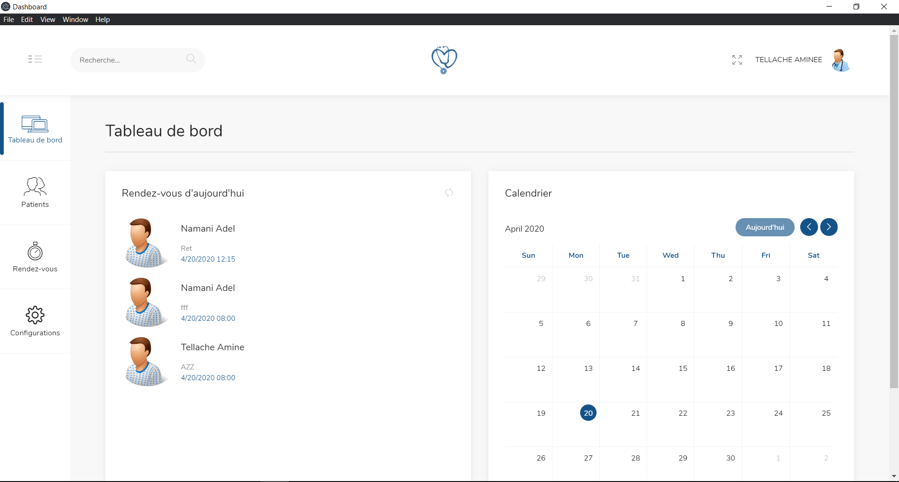
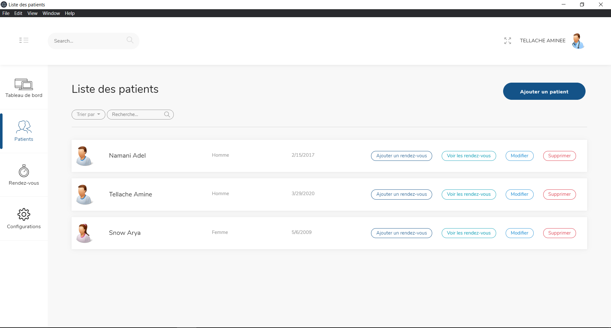
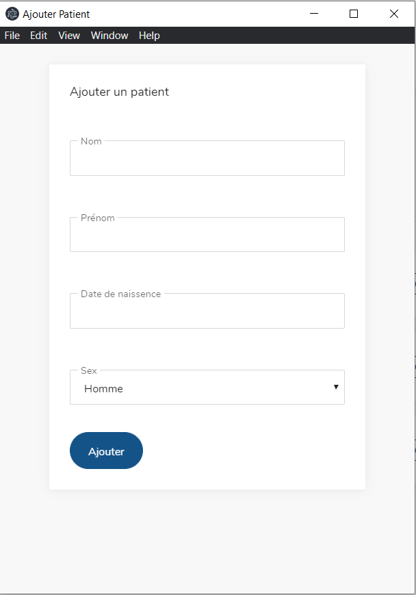
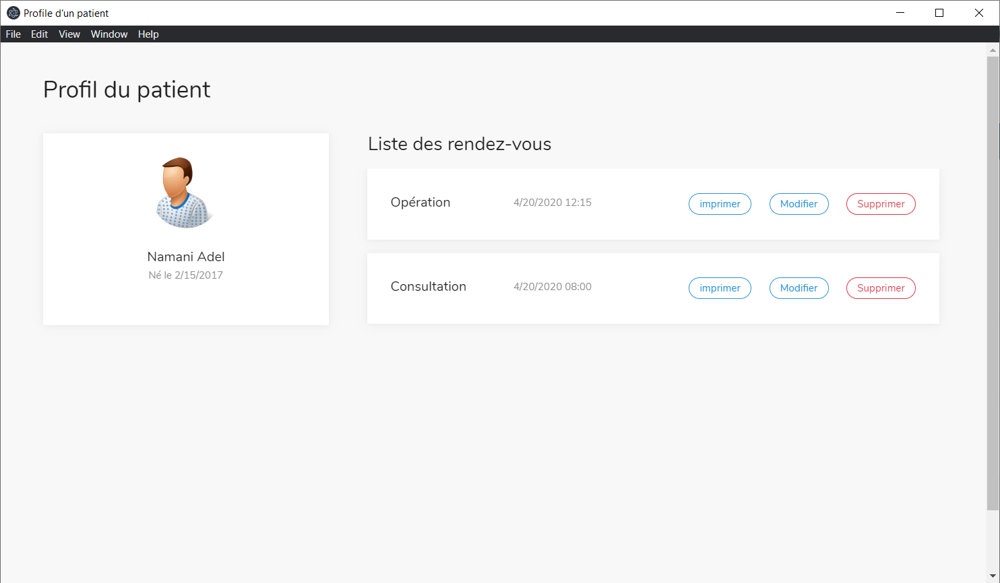
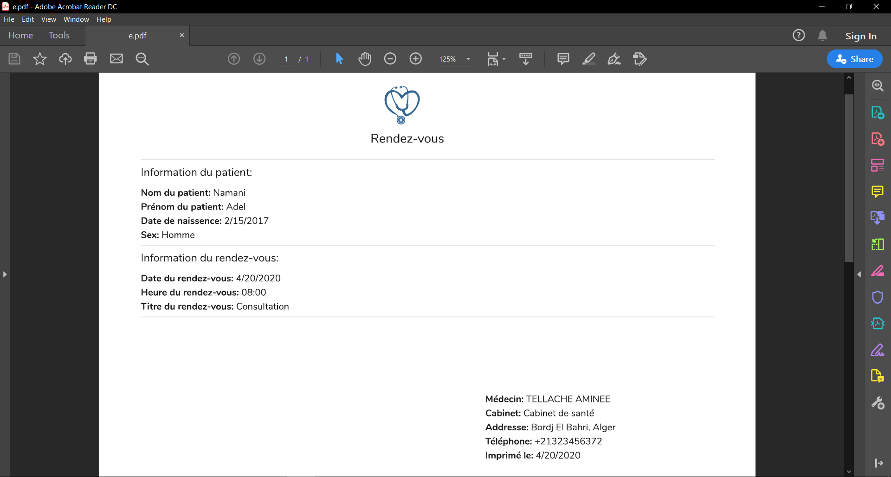
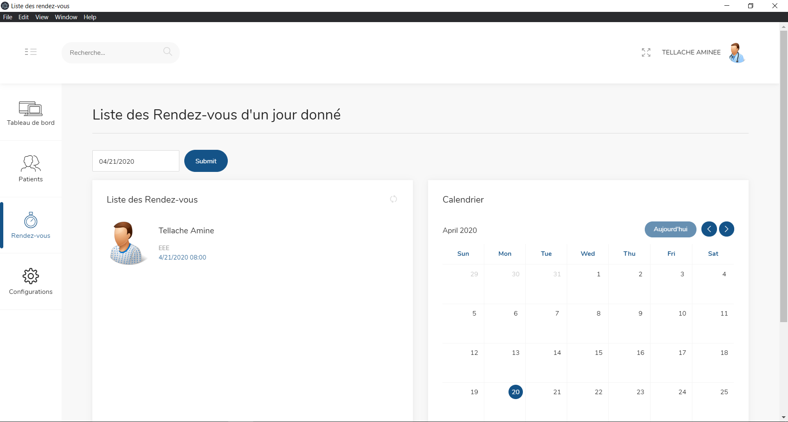
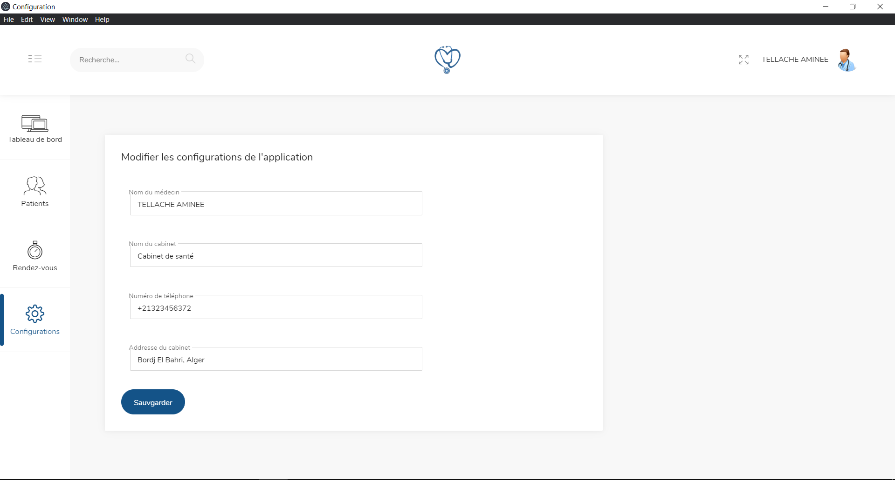

# Plateforme de prise des rendez-vous

## Pour utiliser:

Pour cloner et exécuter cette application, vous aurez besoin de [Git] (https://git-scm.com) et [Node.js] (https://nodejs.org/en/download/) (fourni avec [npm ] (http://npmjs.com)) installé sur votre ordinateur, ***ainsi qu'une base de données mysql lancé sur le port par défaut (3306)***. Depuis votre ligne de commande:

```bash
# Clone this repository
https://github.com/tellach/appointment-booking-platform.git
# Go into the repository
cd appointment-booking-platform
# Install dependencies
npm install
# Run the app
npm start
```

## Fonctionnalités de l'application 

- Voir le dashboard qui contient les rendez-vous d'ajourd'hui.
- Voir la liste des patients, ajouter, modifier et supprimer.
- Ajouter un rendez-vous à un patient.
- Voir les rendez-vous d'un patient avec la possibilité de modifier, impirmer et supprimer.
- Voir les rendez-vous d'un jour donnée.
- Modifier les paramètres de l'application

## Screenshots
- Dashboard

-Liste des patients

-Ajouter un patient

-Profile d'un patient

-Rendez-vous imprimé

-Rendez-vous d'un jour donnée

-Configurations
